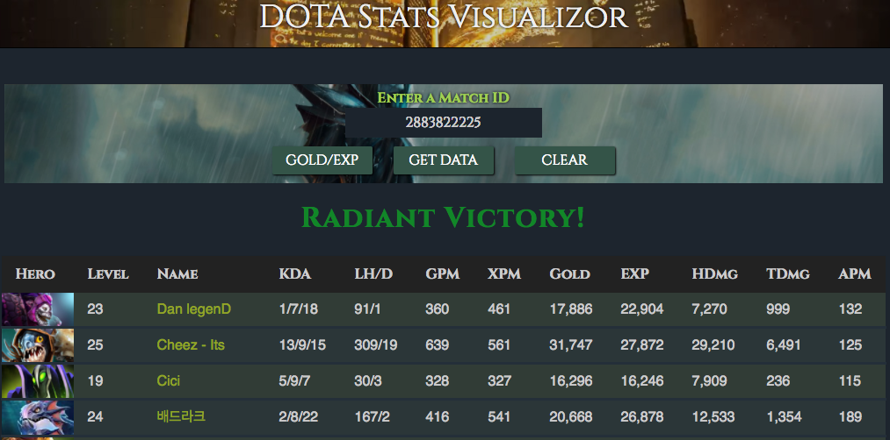

# DOTA Stats Visualizer
[live](https://direcorgi.github.io/Dota-Visualizor/)

DOTA stats visualizer is data visualizer for DOTA 2 match data, created in D3.js.

### Libraries and NPM Packages
- D3.js
- jQuery
- Webpack
- babel

### Data and API
Data is taken from the OpenDota public open source API [documentation](https://docs.opendota.com/). By requesting a specific match id, the API returns a 16,000+ line JSON file that contains the entire details for the match.

The goal of the stats visualizer is to present the most valuable parts of this data in a visually pleasing and presentable way.

### Usage
Enter a match id and hit get data to create the initial summary table. Click Gold/Exp to create the gold and exp advantage graphs. Some sample match ids are in the footer. Leaving the field blank will return a default match id that is stored locally.



### Implementation
The table and graphs are created using the D3.js library. Only select parts from the raw data are used. Raw data is parsed and converted to proper formats using helper functions in the util.js file, and the d3.format helper method:
```javascript
  export const parsePlayers = (players) => {
    const format = d3.format(',');
    return players.map((player) => {
      let name = "anonymous";
      if (player.personaname) name = player.personaname;
      return {
        Hero: player.hero_id,
        Level: player.level,
        Name: name,
        KDA: `${player.kills}/${player.deaths}/${player.assists}`,
        'LH/D': `${player.last_hits}/${player.denies}`,
        'GPM': player.gold_per_min,
        'XPM': player.xp_per_min,
        'Gold': format(player.total_gold),
        'EXP': format(player.total_xp),
        'HDmg': format(player.hero_damage),
        'TDmg': format(player.tower_damage),
        APM: player.actions_per_min,
      };
    });
  };
```
A sample of the raw data can be found in the lib/data/sample_data.js file.

### Future Features
1. Additional graphs
2. Side by side comparisons
3. Lookup games by player id
